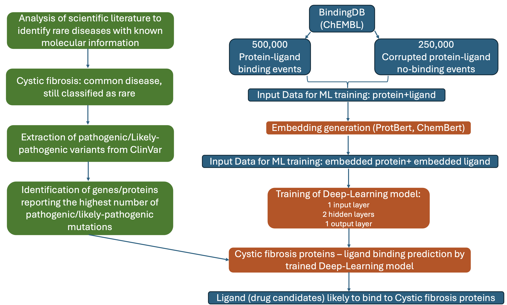

# Team4_AI_Drug_Targets_Rare_Diseases
Main project tasks:
## Find a relevant rare-disease for which genetic information are available regarding the existing variants

We will focus on cystic fibrosis that is common among the world populations but still considered rare.
Drug treatment of cystic fibrosis mainly targets the CFTR gene (Cystic Fibrosis Transmembrane Conductance Regulator). Drugs aim to correct the expression expression or function of the defective CFTR protein. The relevance of CFTR for th treatment of cystic fibrosis is also remarked by the number of pathogenic or likely-pathogenic variants hosted on Clinvar (https://www.ncbi.nlm.nih.gov/clinvar) that are linked to this gene. Based on Clinvar, CFTR presents 1102 Pathogenic/Likely-pathogenic variants. These 1102 variants include the following main variant types:
| **Mutation type**    | **Count**                  |
| ----------------- | --------------------------- |
| Deletion | 404 |
| Duplication | 127 |
| Indel | 28 |
| Insertion | 10 |
| Microsatellite | 20 |
| Copy number loss | 1 |
| single nucleotide variant | 504 |

Drugs currently available to treat cystic fibrosis are the following:

| **Drug Class**    | **Target**                  | **Example**                     |
| ----------------- | --------------------------- | ------------------------------- |
| Potentiator       | CFTR gating                 | Ivacaftor                       |
| Corrector         | CFTR folding/trafficking    | Lumacaftor, Tezacaftor          |
| Amplifier         | CFTR expression             | Nesolicaftor (experimental)     |
| Readthrough agent | Premature stop codons       | Ataluren                        |
| Gene therapy      | CFTR gene                   | CRISPR, mRNA delivery           |
| ENaC inhibitors   | Sodium channel              | BI 1265162 (investigational)    |
| Anti-inflammatory | Neutrophilic inflammation   | Lenabasum, ibuprofen            |
| Mucolytics        | Mucus degradation/hydration | Dornase alfa, hypertonic saline |

We obtained the chemical structure of Ivacaftor and we plan to obtain the same information for others drugs that targets cystic fibrosis with the aim of comparing the structure of the drugs currently used to treat cystic fibrosis with the ligand that will be identified through our machine learning model.

## Select a database of protein-ligand interactions to be used as input for the training of the ML model
We selected BindingDB as the database of protein-ligand interactions to be used as input for the training of the ML model (https://www.bindingdb.org/rwd/bind/chemsearch/marvin/Download.jsp). 
BindingDB was selected because:

1. it is provided in several iteration (data extracted from ChEMBL, Patents, Publications) thus allowing to test the quality of distinct source of information or to combine them to obtain better accuracy in the prediction of the ML model;
2. it is freely available for academic use;
3. it contains a number of protein-ligand interaction that is sufficiently high for the training of an ML model (e.g. >500,000 entries available in ChEMBL BindingDB database);
4. it provides ligand in SMILE format and sequences in AA format, which can fit the type of input files needed for the training of the ML model.

BindingDB contains examples in which a ligand binds a protein. However, the training of an ML model also requires "negative" examples of interactions where a ligand is not expected to bind the protein. To generate pairs of proteins and ligands expected to not interact, we replaced the 30% of the aminoacid of the protein sequence with some other aminoacid thus leading to a protein that is likely to lack the structural properties that would allow the establishment of a protein-ligand interaction.
   
## Find a tool to generate embeddings from the protein sequences
SMILE representation of ligands and protein sequences cannot be used as input for the training of the ML model as they are, but instead need to be converted into embeddings which are "low-dimensional, learned vector representations of high-dimensional or complex data, where similar inputs are mapped to nearby points in the vector space". To convert SMILE and aminoacid sequences into embeddings, we first considered the tool ESM-AA (https://github.com/zhengkangjie/ESM-AA/tree/main). ESM-AA is able to convert SMILE representation into embeddings and we still have to evaluate if the same process can also be performed on aminoacid sequences. We plan to evaluate additional tools for the generation of embeddings after the first iteration of the training and validation of the ML model.

## Build a first-prototype of the deep learning model using a basic architecture
We built a first prototype of a deep-learning (DL) model that is expected to take the BindingDB dataset as an input and to be used to predict the interaction between known biomarkers of cystic fibrosis and ligands (drugs) that are available in BindingDB. We first considered a simple DL architecture built through the keras Sequential() API as follows:

1. input layer with 3050 nodes and relu activation function
2. first hidden layer with 2000 nodes and relu activation function
3. second hidden layer with 2000 nodes and relu activation function
4. output layer with a single node (1/0 prediction of the model) and sigmoid activation function.

The model was then compiled setting the loss to 'binary_crossentropy', the optimizer to 'adam' and requiring the 'accuracy' metrics to be computed.

The performance of this basic DL architecture will be compared with the performance of models that are already available.

## Flowchart of ML pipeline for Cystic Fibrosis Drug Prediction

